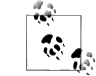
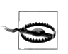

# Manual Content

## Introduction
* [x] What to expect and for whom is it for
* [x] Pre and cons
* [x] Language examples
* [x] Overview of the manual
* [ ] Conventions
  * [ ] Italic: Indicates new terms, URLs, email addresses, filenames, and file extensions.
  * [ ] Constant width: Used for program listings, as well as within paragraphs to refer to element and attribute names, program examples, attribute value literals, start- and end-tags, and source code example text.
  * [ ] Constant width bold: Shows commands or other text that should be typed literally by the user.
  * [ ] Constant width italic: Shows text that should be replaced with user-supplied values or by values determined by context. An example is filename, where the word “filename” is a placeholder for the actual filename.
  * [ ] : This icon signifies a tip, suggestion, or general note.
  * [ ] : This icon indicates a warning or caution.
  The icons are examples from other books. Need to use other symbols or devise my own to prevent license problems. Also the text must be placed in an `aside` area.

## Overview
* Install and setup. This part will help you to start by showing how to install the package and make a start with your first document.
  * [x] Zef installer program.
  * [x] Install command.
  * [x] Atom editor, language-sxml module for syntax highlighting.
* The package. An overview of the parts comprising the package. This section will tell something about the parsing modules, the included XML generating modules, the programs and configuration.
    * [ ] Classes belonging to the core of the library
    * [ ] Classes added for convenience
    * [ ] Programs
* [ ] The language or syntax
* [ ] Configuration.
* [ ] The programmers view.
* [ ] The programs.
* [ ] Examples

## Syntax
* [ ] Sigils: **$ \$!**
* [ ] Elements: **$foo**
* [ ] Attributes: **$foo bar=5 baz='a b' taz="a b" caz=<2,3,4> =xyz =!pqr []**
* [ ] Content: **[ ] { } « »**
* [ ] Methods: **$!foo.bar**
* [ ] Text
* [ ] Comments: **#**
* [ ] Escape character: **\\**
* Namespaces
  * [ ] Reserved namespace: **sxml*** [x] reserved prefix name is **sxml**
  * [ ] url for the ns is **https://github.com/MARTIMM/Semi-xml**
  * Elements
    * [ ] **sxml:fragment**. Top level element. Not always visible when only one top element is created.
    * [ ] **sxml:TN- < max-10-characters-text > - < 3-digit-hexnum >**. Text node names generated from the content and a generator e.g. **sxml:TN-thatsit-00A**.
    * [ ] **sxml:comment**. XML comment `<!-- ... -->`.
    * [ ] **sxml:cdata**. XML CDATA `<![CDATA[ ... ]]>`.
    * [ ] **sxml:pi**. XML Processing Instruction `<?target attributes content ?>`
    * [ ] **sxml:xml**. Direct insertion of XML text.
    * [ ] **sxml:var-decl**. Declare a variable.
    * [ ] **sxml:var-ref**. Reference to a variable declaration.
    * [ ] **sxml:module-label.method**. Generated name for a method node.
  *  Attributes
    * [ ] **sxml:inline**
    * [ ] **sxml:keep**
    * [ ] **sxml:noconv**
    * [ ] **sxml:close**

## Configuration
* [ ] Toml
* [ ] Refine input, output keywords
* [ ] Configuration locations
* [ ] Refinement process
* [ ] Predefined table entries
* Tables
  * [ ] C Table
  * [ ] D Table
  * [ ] DN Table
  * [ ] E Table
  * [ ] F Table
  * [ ] H Table
  * [ ] ML Table
  * [ ] R Table
  * [ ] S Table
  * [ ] T Table
  * [ ] U Table
  * [ ] X Table

## API
* Program Interface
  * [ ] sxml2xml.pl6
  * [ ] xml2sxml.pl6
* Main library class
  * [ ] Class SemiXML::Sxml
  * [ ] Exception class X::SemiXML

## Method Interface
* Method api
  * [ ] initialization
  * [ ] call interface

## Other modules and methods
* [ ] Configuration ML table
* [ ] Module SemiXML.pm6
* [ ] Class SemiXML::Globals
* Predefined methods
  * [ ] Predefined module label **SxmlCore**
  * [ ] **\$!SxmlCore.date**
  * [ ] **\$!SxmlCore.date-time**
  * [ ] **\$!SxmlCore.var-decl**
  * [ ] **\$!SxmlCore.drop**
